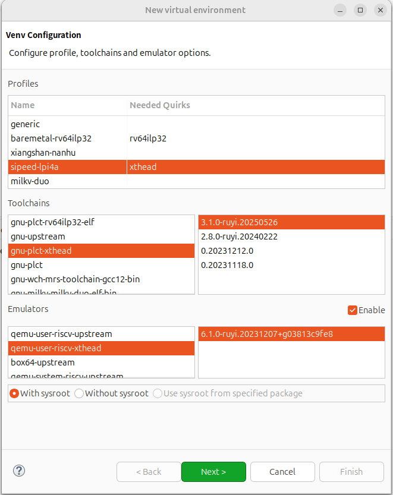
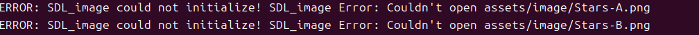

### 不要复制粘贴虚拟环境，因为toolchain.cmake写死掉了

### 开始

- 获取项目
```
git clone https://github.com/WispSnow/SDLShooter.git
```
- 使用 Eclipse 打开项目： File -> Open Projects from File System...


### 创建虚拟环境到项目目录

#### 方式一：使用可视化界面

- RuyiSDK -> Venv -> New virtual environment...

- 勾选配置



- 选择虚拟环境路径，创建虚拟环境，名称为 .venv


#### 方式二：使用命令行

- 在项目路径下，在终端输入以下命令：

```
ruyi venv -t gnu-plct-xthead -e qemu-user-riscv-xthead sipeed-lpi4a ./sipeed-xthead-venv

```

- 尝试使用其他工具链

```
ruyi venv -t gnu-plct -e qemu-user-riscv-upstream generic ./gnu-plct-venv

```

### 使用虚拟环境构建项目
- 向 sysroot 添加 SDL2 相关依赖

```
# 同步常用运行时库和用户空间（保留符号链接/权限/ACL/xattrs）
rsync -aHAX --numeric-ids -e "ssh -p 12055" \
  root@localhost:/usr/include/ \
  ./gnu-plct-venv/sysroot/usr/include/

rsync -aHAX --numeric-ids -e "ssh -p 12055" \
  root@localhost:/lib/ \
  ./gnu-plct-venv/sysroot/lib/

rsync -aHAX --numeric-ids -e "ssh -p 12055" \
  root@localhost:/lib64/ \
  ./gnu-plct-venv/sysroot/lib64/

rsync -aHAX --numeric-ids -e "ssh -p 12055" \
  root@localhost:/usr/lib/ \
  ./gnu-plct-venv/sysroot/usr/lib/

rsync -aHAX --numeric-ids -e "ssh -p 12055" \
  root@localhost:/usr/lib64/ \
  ./gnu-plct-venv/sysroot/usr/lib64/

# 可选：同步 /usr/bin, /usr/sbin（某些 helper 程序可能需要）
rsync -aHAX --numeric-ids -e "ssh -p 12055" \
  root@localhost:/usr/bin/ \
  ./gnu-plct-venv/sysroot/usr/bin/

rsync -aHAX --numeric-ids -e "ssh -p 12055" \
  root@localhost:/usr/sbin/ \
  ./gnu-plct-venv/sysroot/usr/sbin/

```
- 激活虚拟环境
```
source ./gnu-plct-venv/bin/ruyi-activate
```
```
mkdir build && cd build

# 使用绝对路径
cmake -DCMAKE_TOOLCHAIN_FILE=$HOME/RuyiSDKGames/SDLShooter/gnu-plct-venv/toolchain.cmake \
      -DCMAKE_SYSROOT=$HOME/RuyiSDKGames/SDLShooter/gnu-plct-venv/sysroot \
      -DCMAKE_EXE_LINKER_FLAGS="-static-libstdc++ -static-libgcc" \
      ..

```
```
cmake -DCMAKE_TOOLCHAIN_FILE=$HOME/RuyiSDKGames/SDLShooter/gnu-plct-venv/toolchain.cmake \
      -DCMAKE_SYSROOT=$HOME/RuyiSDKGames/SDLShooter/gnu-plct-venv/sysroot.riscv64-plct-linux-gnu \
      -DCMAKE_EXE_LINKER_FLAGS="-static-libstdc++ -static-libgcc" \
      ..
```

```
cmake -DCMAKE_TOOLCHAIN_FILE=$HOME/RuyiSDKGames/SDLShooter/gnu-plct-venv/toolchain.cmake -DCMAKE_SYSROOT=$HOME/RuyiSDKGames/SDLShooter/gnu-plct-venv/sysroot -DCMAKE_EXE_LINKER_FLAGS="-static-libstdc++ -static-libgcc" ..

```

```
cmake -DCMAKE_TOOLCHAIN_FILE=/home/jxy/RuyiSDKGames/SDLShooter/gnu-plct-venv/toolchain.cmake \
      -DCMAKE_SYSROOT=/home/jxy/RuyiSDKGames/SDLShooter/gnu-plct-venv/sysroot \
      -DCMAKE_FIND_ROOT_PATH=/home/jxy/RuyiSDKGames/SDLShooter/gnu-plct-venv/sysroot \
      -DCMAKE_PREFIX_PATH="/home/jxy/RuyiSDKGames/SDLShooter/gnu-plct-venv/sysroot/usr/lib64/cmake/SDL2;/home/jxy/RuyiSDKGames/SDLShooter/gnu-plct-venv/sysroot/usr/lib64/cmake/SDL2_image;/home/jxy/RuyiSDKGames/SDLShooter/gnu-plct-venv/sysroot/usr/lib64/cmake/SDL2_mixer;/home/jxy/RuyiSDKGames/SDLShooter/gnu-plct-venv/sysroot/usr/lib64/cmake/SDL2_ttf" \
      -DCMAKE_EXE_LINKER_FLAGS="-static-libstdc++ -static-libgcc" \
      ..

```
```
cmake -DCMAKE_TOOLCHAIN_FILE=$HOME/RuyiSDKGames/CppND-Capstone-Snake-Game/gnu-plct-venv/toolchain.cmake \
      -DCMAKE_SYSROOT=$HOME/RuyiSDKGames/CppND-Capstone-Snake-Game/gnu-plct-venv/sysroot \
      -DCMAKE_EXE_LINKER_FLAGS="-static-libstdc++ -static-libgcc" \
      ..
```
```
cmake -DCMAKE_TOOLCHAIN_FILE=$HOME/RuyiSDKGames/CppND-Capstone-Snake-Game-2/gnu-plct-venv/toolchain.cmake \
      -DCMAKE_SYSROOT=$HOME/RuyiSDKGames/CppND-Capstone-Snake-Game-2/gnu-plct-venv/sysroot \
      -DCMAKE_EXE_LINKER_FLAGS="-static-libstdc++ -static-libgcc" \
      ..
```
```
ruyi-qemu -L ~/RuyiSDKGames/CppND-Capstone-Snake-Game/gnu-plct-venv/sysroot/ ./SnakeGame
```
```
source ../gnu-plct-venv/bin/ruyi-activate

ruyi-qemu -L ~/RuyiSDKGames/SDLShooter/gnu-plct-venv/sysroot/ ./SDLShooter-Linux
```
```

env SDL_AUDIODRIVER=dummy LIBGL_ALWAYS_SOFTWARE=1 ruyi-qemu -L ~/RuyiSDKGames/SDLShooter/gnu-plct-venv/sysroot/ ./SDLShooter-Linux
```

执行路径回到项目目录下
```
cd ..

env SDL_AUDIODRIVER=dummy LIBGL_ALWAYS_SOFTWARE=1 ruyi-qemu -L ~/RuyiSDKGames/SDLShooter/gnu-plct-venv/sysroot/ ./build/SDLShooter-Linux
```


